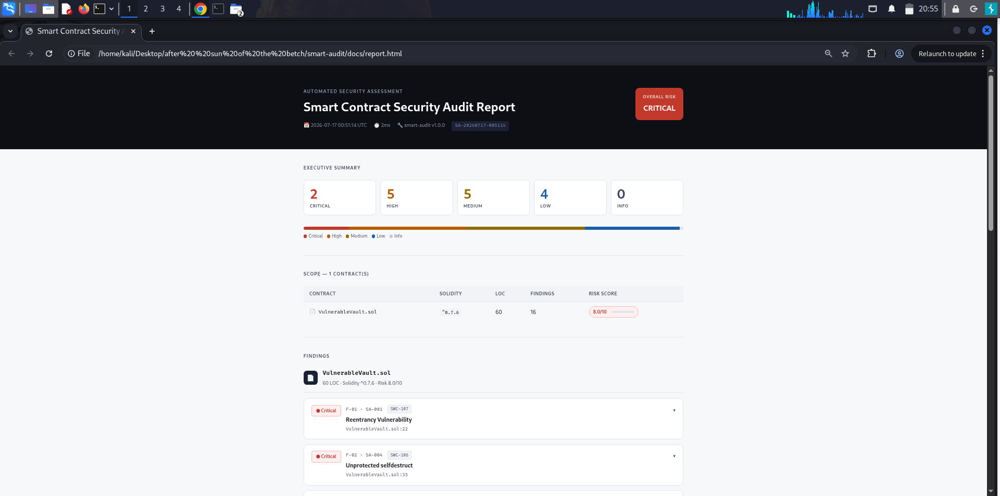

<div align="center">


# smart-audit

**Fast, dependency-free static analyzer for Solidity**

A first-pass security scanner for contracts: pattern rules plus lightweight function-level analysis. Built to run in CI in milliseconds. Not a substitute for a manual audit.

[](https://github.com/Al-Gharbi/smart-audit/actions)
[](https://go.dev)
[](LICENSE)
[](go.mod)
[](https://github.com/Al-Gharbi/smart-audit/releases)
[](CONTRIBUTING.md)

[Installation](#installation) · [Usage](#usage) · [Report Formats](#report-formats) · [Vulnerability Database](#vulnerability-database) · [CI/CD Integration](#cicd-integration) · [Contributing](#contributing)

---


</div>

---

## What is smart-audit?

`smart-audit` is a **zero-dependency CLI tool** written in Go that performs static analysis on Solidity source. It has **18 rules** — from reentrancy to flash-loan oracle risk — and writes reports in HTML, JSON and Markdown.

Five rules (reentrancy, unchecked calls, unprotected `selfdestruct`, missing zero-address check, missing event) read the structure of each function — contracts, state variables, function bodies — so they can tell `call-then-write` from correct checks-effects-interactions. The rest are source-level patterns. It does **not** do data-flow, type or cross-contract analysis; see [Limitations](#limitations).

Built for security researchers, DeFi developers, and CI/CD pipelines. No setup required beyond a single binary.

```bash
$ smart-audit scan testdata/VulnerableVault.sol -f html -o audit-report.html

  AUDIT SUMMARY  14 finding(s) in 1 contract(s)
  CRITICAL      2
  HIGH          5
  MEDIUM        5
  LOW           2
  ⚠ VulnerableVault.sol  [14 finding(s) · Risk 8.2/10]
      [CRITICAL] Reentrancy Vulnerability  (line 22)
      [CRITICAL] Unprotected selfdestruct  (line 35)
      [HIGH    ] tx.origin Used for Authentication  (line 29)
      [MEDIUM  ] Unchecked Low-Level Call Return Value  (line 65)
      ...

✓ Report saved → audit-report.html
```

---

## Features

- **🔍 18 rules** — mapped to SWC/CWE; 5 of them function-aware (see below)
- **📊 3 report formats** — self-contained HTML with expandable findings, structured JSON, GitHub-ready Markdown
- **⚡ Zero dependencies** — single static binary, no runtime requirements
- **🎯 Risk scoring** — per-contract weighted risk score (0–10)
- **🔗 Slither integration** — optional: merges Slither detector output when `slither` is in `PATH` (not exercised by the test suite)
- **🐳 Docker support** — works in any containerized environment
- **⚙️ CI/CD ready** — integrates with GitHub Actions, GitLab CI, and pre-commit hooks
- **🌐 Cross-platform** — pre-compiled for Linux, macOS (Intel + Apple Silicon), Windows

---

## Installation

### Pre-built binary (recommended)

Download the binary for your platform from [Releases](https://github.com/Al-Gharbi/smart-audit/releases/latest):

```bash
# Linux (amd64)
curl -L https://github.com/Al-Gharbi/smart-audit/releases/latest/download/smart-audit-linux-amd64 \
  -o smart-audit && chmod +x smart-audit && sudo mv smart-audit /usr/local/bin/

# macOS (Apple Silicon)
curl -L https://github.com/Al-Gharbi/smart-audit/releases/latest/download/smart-audit-darwin-arm64 \
  -o smart-audit && chmod +x smart-audit && sudo mv smart-audit /usr/local/bin/

# Verify
smart-audit version
# smart-audit 1.0.0
```

### From source (requires Go 1.21+)

```bash
git clone https://github.com/Al-Gharbi/smart-audit.git
cd smart-audit
make install
```

### Docker

```bash
docker pull ghcr.io/al-gharbi/smart-audit:latest

docker run --rm -v $(pwd):/data ghcr.io/al-gharbi/smart-audit \
  scan /data/ -r -f html -o /data/audit-report.html
```

---

## Usage

```
smart-audit scan [options] <file|directory> [...]

Options:
  -f, --format       Report format: html | json | md    (default: html)
  -o, --output       Output file path
  -r, --recursive    Scan directories recursively
  -s, --min-severity Hide findings below: critical|high|medium|low|info
      --slither      Enable Slither integration
  -v, --verbose      Verbose output
  -h, --help         Show help
```

### Examples

```bash
# Scan a single file
smart-audit scan Token.sol

# Scan all contracts recursively, HTML report
smart-audit scan ./contracts/ -r -f html -o report.html

# Only report High and Critical findings
smart-audit scan ./src/ -r -s high

# JSON output for programmatic processing
smart-audit scan Vault.sol -f json | jq '.summary'

# Markdown report for GitHub PR comments
smart-audit scan ./contracts/ -r -f md -o SECURITY.md

# With Slither for deeper taint analysis
smart-audit scan ./contracts/ -r --slither

# Scan specific files
smart-audit scan Token.sol Vault.sol Staking.sol -f html
```

---

## Report Formats

### HTML Report

Self-contained, interactive report with expandable findings, severity badges, code snippets, and remediation guidance.

 

### JSON Report

```json
{
  "report_id": "SA-20261007-183533",
  "title": "Smart Contract Security Audit Report",
  "timestamp": "2026-10-07 18:35:33 UTC",
  "duration": "12ms",
  "summary": {
    "total_contracts": 2,
    "total_findings": 14,
    "critical": 2,
    "high": 5,
    "medium": 5,
    "low": 2,
    "info": 0,
    "overall_risk": "CRITICAL"
  },
  "contracts": [...]
}
```

### Markdown Report

Perfect for GitHub PR descriptions and documentation. Example output:

| Severity | Count |
|---|---|
| 🔴 Critical | 2 |
| 🟠 High | 5 |
| 🟡 Medium | 5 |
| 🔵 Low | 2 |

---

## Vulnerability Database

| ID | Title | Severity | SWC |
|----|-------|----------|-----|
| SA-001 | Reentrancy (external call, then state write, same function) | 🔴 Critical | [SWC-107](https://swcregistry.io/docs/SWC-107) |
| SA-002 | tx.origin Authentication | 🟠 High | [SWC-115](https://swcregistry.io/docs/SWC-115) |
| SA-003 | Floating Pragma | 🔵 Low | [SWC-103](https://swcregistry.io/docs/SWC-103) |
| SA-004 | Unprotected selfdestruct (no modifier / `msg.sender` check) | 🔴 Critical | [SWC-106](https://swcregistry.io/docs/SWC-106) |
| SA-005 | Block Timestamp Dependence | 🟡 Medium | [SWC-116](https://swcregistry.io/docs/SWC-116) |
| SA-006 | Delegatecall Injection | 🟠 High | [SWC-112](https://swcregistry.io/docs/SWC-112) |
| SA-007 | Unchecked call/send/delegatecall return value | 🟡 Medium | [SWC-104](https://swcregistry.io/docs/SWC-104) |
| SA-008 | Weak PRNG | 🟠 High | [SWC-120](https://swcregistry.io/docs/SWC-120) |
| SA-009 | Deprecated Functions | 🔵 Low | [SWC-111](https://swcregistry.io/docs/SWC-111) |
| SA-010 | Missing zero-address check (parameter stored in state) | 🟡 Medium | [SWC-131](https://swcregistry.io/docs/SWC-131) |
| SA-011 | Integer Overflow (< 0.8.0) | 🟠 High | [SWC-101](https://swcregistry.io/docs/SWC-101) |
| SA-012 | Inline Assembly | 🟡 Medium | [SWC-127](https://swcregistry.io/docs/SWC-127) |
| SA-013 | Hard-coded Address | 🔵 Low | [SWC-134](https://swcregistry.io/docs/SWC-134) |
| SA-014 | Flash-Loan Oracle Manipulation | 🟠 High | custom |
| SA-015 | Unchecked Arithmetic Block | 🟡 Medium | SWC-101 |
| SA-016 | Owner/admin changed without event (constructors excluded) | 🔵 Low | custom |
| SA-017 | Signature Replay | 🟠 High | [SWC-121](https://swcregistry.io/docs/SWC-121) |
| SA-018 | DoS via Unbounded Loop | 🟡 Medium | [SWC-128](https://swcregistry.io/docs/SWC-128) |

---

## CI/CD Integration

### GitHub Actions

Add to `.github/workflows/security.yml`:

```yaml
name: Smart Contract Security Audit

on:
  push:
    paths: ['contracts/**', 'src/**']
  pull_request:
    paths: ['contracts/**', 'src/**']

jobs:
  audit:
    runs-on: ubuntu-latest
    steps:
      - uses: actions/checkout@v4

      - name: Install smart-audit
        run: |
          curl -L https://github.com/Al-Gharbi/smart-audit/releases/latest/download/smart-audit-linux-amd64 \
            -o smart-audit && chmod +x smart-audit

      - name: Run security audit
        run: ./smart-audit scan ./contracts/ -r -s medium --fail-on high -f md -o AUDIT.md

      - name: Upload audit report
        uses: actions/upload-artifact@v4
        with:
          name: security-audit-report
          path: AUDIT.md

      - name: Comment PR with findings
        if: github.event_name == 'pull_request'
        uses: actions/github-script@v7
        with:
          script: |
            const fs = require('fs');
            const report = fs.readFileSync('AUDIT.md', 'utf8');
            github.rest.issues.createComment({
              issue_number: context.issue.number,
              owner: context.repo.owner,
              repo: context.repo.repo,
              body: report.slice(0, 65000)
            });
```

### Hardhat Integration

Add to `hardhat.config.js`:

```javascript
task("audit", "Run smart-audit on contracts", async () => {
  const { execSync } = require("child_process");
  execSync("smart-audit scan ./contracts/ -r -f html -o audit-report.html", {
    stdio: "inherit"
  });
});
```

```bash
npx hardhat audit
```

### Pre-commit Hook

```bash
# .git/hooks/pre-commit
#!/bin/bash
smart-audit scan ./contracts/ -r --fail-on high -f md -o /dev/null
if [ $? -eq 2 ]; then
  echo "❌ Security audit failed. Fix High/Critical findings before committing."
  exit 1
fi
```

---

## How It Works

smart-audit uses a multi-stage analysis pipeline:

```
Solidity Files
      │
      ▼
  Strip Comments ──► prevents false positives from commented code
      │
      ▼
  Mask strings ──► blank string literals so braces/semicolons inside them are inert
      │
      ▼
  Structure ──► contracts, state variables, function bodies (balanced braces)
      │
      ▼
  Rules ──► 13 regex rules + 5 function-aware detectors
      │
      ▼
  Locate ──► maps matches to line numbers + snippets
      │
      ▼
  Risk Scoring ──► weighted formula: score = (max×0.6) + (avg×0.4)
      │
      ▼
  Report Generation ──► HTML / JSON / Markdown
```

### Adding Custom Rules

```go
// internal/analyzer/patterns.go
var Patterns = []Pattern{
  // ... existing patterns ...
  {
    ID:          "SA-019",
    Title:       "My Custom Rule",
    Description: "Description of what this detects.",
    Severity:    "HIGH",
    SWC:         "custom",
    Recommendation: "How to fix it.",
    Regex: regexp.MustCompile(`your_regex_here`),
    // Optional: Exclude drops a match whose source line also matches it.
    // Optional: Detect: myDetector, // a structural rule, see detectors.go
  },
}
```

---

## Optional: Slither Integration

For deeper dataflow and taint analysis:

```bash
# Install Slither
pip install slither-analyzer

# Run with Slither
smart-audit scan ./contracts/ -r --slither
```

smart-audit works completely standalone without Slither — it is entirely optional.

---

## Development

```bash
make build    # Build binary
make test     # Run tests with race detector
make release  # Cross-compile for all platforms
make docker   # Build Docker image
make help     # Show all targets
```

### Running Tests

```bash
go test ./... -race -cover
```

67 test cases (including subtests) across the analyzer, CLI and reporters; about 80% statement coverage overall (analyzer 86%, cmd 74%, reporters 68%). The suite includes negative cases for each function-aware rule, e.g. a checks-effects-interactions withdraw must **not** be reported as reentrancy.

---

## Limitations

smart-audit is a quick first pass. Know what it cannot see:

* **No data-flow, type or cross-contract analysis.** Reentrancy is reported only when a low-level `.call` is followed by a write to contract state in the *same function*. Cross-function, cross-contract, read-only and token-callback (ERC-777/721) reentrancy are not detected.
* **Pattern rules are noisy by nature.** For example SA-005 (`block.timestamp`) reports every use, and SA-013 reports every hard-coded address.
* **Writes are matched by name.** A local variable that shadows a state variable can be mistaken for a state write.
* **Inheritance is not resolved.** A modifier or state variable declared in a parent contract in another file is invisible.
* **Slither integration** is optional and is not covered by the test suite.

For anything that will hold value, combine it with Slither, a fuzzer/invariant tests and a manual review.

---

## Contributing

Contributions welcome! See [CONTRIBUTING.md](CONTRIBUTING.md).

**Adding a new vulnerability rule:**
1. Add a `Pattern` struct to `internal/analyzer/patterns.go`
2. Write a unit test in `internal/analyzer/analyzer_test.go`
3. Run `go test ./...`
4. Submit a PR with the SWC/CWE reference

---

## Roadmap

- [ ] Resolve inheritance across files for modifiers and state variables
- [ ] SA-019: Centralization risk detection
- [ ] SA-020: Chainlink oracle staleness check
- [ ] SA-021: ERC20 approval front-running
- [ ] Foundry project integration
- [ ] SARIF output format for GitHub Security tab
- [ ] VS Code extension

---

## License

MIT © [Al-Gharbi](https://github.com/Al-Gharbi)

---

<div align="center">

**If smart-audit helped you find a bug, please ⭐ the repo.**

Made by a security researcher in Yemen 🇾🇪

</div>
